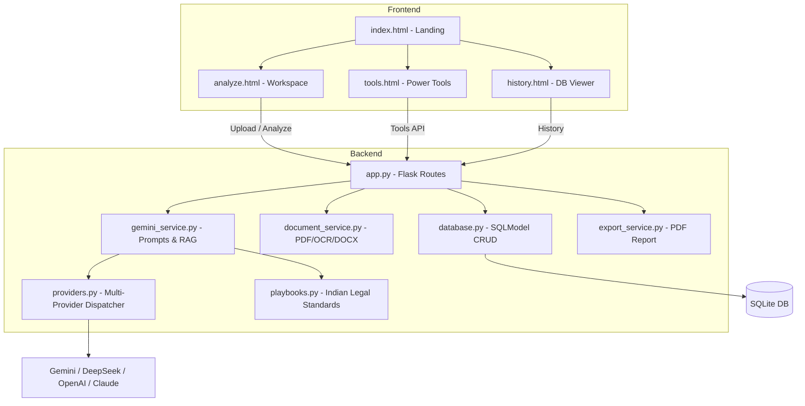

# ClauseClear AI ⚖️

> AI-powered legal contract analysis — understand risks, obligations, and health scores for any contract in seconds.

**Live Demo:** [https://github.com/THARUN9959/Clause-Clear-AI](https://github.com/THARUN9959/Clause-Clear-AI)

---

## 📋 Overview

ClauseClear AI is a full-stack Generative AI web application for legal contract simplification. It uses **Gemini 2.5 Flash** with advanced context engineering — structured JSON prompts, session memory, RAG context injection, and Indian legal playbooks — to turn dense contracts into clear, actionable insights.

Built for developers, legal teams, and anyone who needs to understand what they're signing before they sign it.

---

## ✨ Features

### Core Analysis
| Feature | Description |
|---|---|
| **Unified Analysis** | One-click full pipeline: contract classification → health scoring → risk detection → obligations extraction |
| **Risk Highlighter** | Clause-level risk labeling: `HIGH_RISK`, `RISK`, `NEUTRAL`, `POSITIVE` with statute citations |
| **Health Score** | 0–100 score with letter grade (A–F) and plain-English verdict |
| **Obligations Tracker** | Structured table of every obligation, deadline, and responsible party |
| **AI Chat** | Follow-up Q&A with 10-turn session memory powered by SQLite persistence |

### Advanced Tools
| Tool | Description |
|---|---|
| **Compare Contracts** | Semantic redlining between two contract versions — shows additions, deletions, and who benefits |
| **Extract Entities** | Pulls parties, dates, payment terms, governing law, and defined terms into structured cards |
| **Plain Language** | Rewrites every clause in everyday English with a jargon glossary |
| **Multilingual Translate** | Translates the full contract into 10+ languages clause by clause |
| **Contract Checklist** | Scores the contract against 10 essential legal clauses (Governing Law, IP, Indemnification, etc.) |

### Smart Infrastructure
- 🔄 **Multi-Provider Fallback Chain**: Gemini → DeepSeek → OpenAI → Claude (automatic failover)
- 📄 **Document Parsing**: TXT, PDF (text + scanned/OCR via Tesseract), and DOCX
- 🧠 **RAG Context Injection**: Embeds prior high-risk clauses via `text-embedding-004` and cosine similarity
- ⚖️ **Indian Legal Playbooks**: Grounds analysis in Indian Contract Act 1872, DPDP Act 2023, IT Act 2000
- 🛡️ **Self-Critique Loop**: AI reviews its own output for accuracy before presenting results
- 📑 **PDF Export**: Download a full styled analysis report (FPDF2)
- 🌙 **Dark / Light Theme**: Persistent theme toggle with deep navy dark mode default

---

## 🛠️ Tech Stack

| Layer | Technology |
|---|---|
| **Backend** | Python 3.8+, Flask 3.1, SQLModel (SQLite) |
| **AI — Primary** | Google Gemini 2.5 Flash (`google-genai 1.14`) |
| **AI — Fallbacks** | DeepSeek (OpenAI-compatible), OpenAI GPT-4o, Anthropic Claude |
| **Embeddings** | `text-embedding-004` (Google) |
| **Document Parsing** | PyPDF2, pytesseract, python-docx, Pillow |
| **Security** | Flask-WTF (CSRF), Flask-Limiter (rate limiting), DOMPurify (XSS) |
| **Frontend** | HTML5, Vanilla CSS3, Vanilla JS, Playfair Display + Inter fonts |
| **PDF Export** | fpdf2 2.8 |

---

## 🚀 Getting Started

### Prerequisites
- Python 3.8+
- A [Google Gemini API Key](https://aistudio.google.com/app/apikey)
- (Optional) Tesseract OCR installed for scanned PDF support

### Installation

```bash
# 1. Clone the repository
git clone https://github.com/THARUN9959/Clause-Clear-AI.git
cd Clause-Clear-AI

# 2. Create and activate a virtual environment
python -m venv venv
venv\Scripts\activate       # Windows
# source venv/bin/activate  # macOS/Linux

# 3. Install dependencies
pip install -r requirements.txt
```

### Environment Setup

Create a `.env` file in the project root:

```env
GEMINI_API_KEY=your_gemini_api_key_here

# Optional fallback providers
DEEPSEEK_API_KEY=your_deepseek_key_here
OPENAI_API_KEY=your_openai_key_here
ANTHROPIC_API_KEY=your_anthropic_key_here

# Optional config
FLASK_SECRET_KEY=your_secret_key_here
```

### Run

```bash
python app.py
```

Open your browser at **http://127.0.0.1:5000**

---

## 📡 API Reference

| Route | Method | Description |
|---|---|---|
| `/` | GET | Landing page |
| `/analyze` | GET | Main analysis workspace |
| `/tools` | GET | Advanced tools page (Compare, Translate, Checklist…) |
| `/history` | GET | Session history & DB viewer |
| `/api/upload` | POST | Upload PDF/DOCX/TXT, returns extracted text |
| `/api/analyze` | POST | Full unified contract analysis |
| `/api/analyze/feature` | POST | Single feature: `summarize`, `highlight`, `tags`, `entities`, `compare`, `multilingual`, `translate` |
| `/api/tools/checklist` | POST | Runs 10-point contract compliance checklist |
| `/api/chat` | POST | Follow-up chat with session memory |
| `/api/history/<id>` | GET | Load a specific past analysis |
| `/api/history/<id>` | DELETE | Delete a specific analysis |
| `/api/export/<id>` | GET | Download analysis as styled PDF |
| `/api/memory` | GET | Get current session memory state |
| `/api/clear-memory` | POST | Clear all session memory |

---

## 🏗️ Architecture



## 📁 Project Structure

```
GENAI-2/
├── app.py                          # Flask app & all routes
├── config.py                       # Config, env loading, model settings
├── requirements.txt                # Python dependencies
├── .env                            # API keys (not in version control)
├── clauseclear.sqlite              # SQLite database (auto-generated)
├── services/
│   ├── providers.py                # Multi-provider AI dispatcher (Gemini → DeepSeek → OpenAI → Claude)
│   ├── gemini_service.py           # Core analysis orchestration, RAG, self-critique
│   ├── prompts.py                  # All prompt templates and feature routing maps
│   ├── playbooks.py                # Indian legal standard instructions
│   ├── benchmark_service.py        # Market standard benchmark data
│   ├── database.py                 # SQLModel models and CRUD operations
│   ├── document_service.py         # PDF, DOCX, and OCR text extraction
│   ├── export_service.py           # FPDF2 PDF report generator
│   └── memory_service.py           # Session memory management
├── templates/
│   ├── base.html                   # Global layout (nav, footer, theme toggle)
│   ├── index.html                  # Landing page
│   ├── analyze.html                # Main analysis workspace
│   ├── tools.html                  # Advanced tools (Compare, Translate, Checklist)
│   └── history.html                # Analysis history & database viewer
├── static/
│   ├── css/style.css               # Full design system (dark/light theme, tokens)
│   └── js/app.js                   # All frontend logic & API fetch wrappers
└── uploads/                        # Temporary file upload directory
```

---

## 🎨 Design System

| Token | Value |
|---|---|
| **Primary Background** | `#060a14` / `#0a0f1e` (deep navy) |
| **Surface Cards** | Glassmorphism with `backdrop-filter: blur(20px)` |
| **Accent Color** | `#d4a853` / `#f0c674` (amber gold) |
| **Heading Font** | Playfair Display (Google Fonts) |
| **Body Font** | Inter (Google Fonts) |
| **Animations** | Float orbs, fade-in, slide-up, CSS spinner |

---

## ⚠️ Disclaimer

ClauseClear AI is designed for **informational purposes only** and does **not** constitute legal advice. Always consult a qualified legal professional before making decisions based on any contract analysis.

---

## 📜 License

This project is for educational and demonstration purposes.
