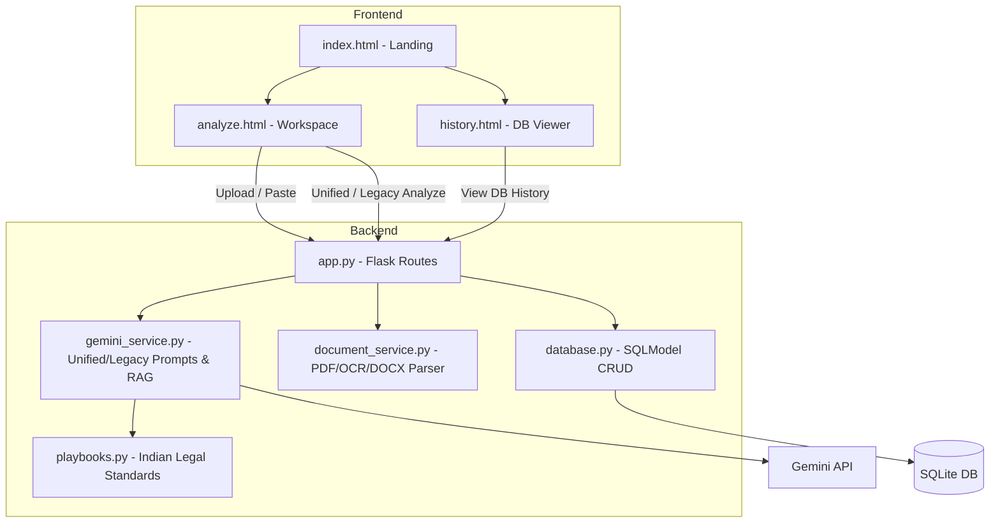

# ClauseClear AI

ClauseClear AI is a full-stack Generative AI web application designed for legal contract simplification. Powered by **Gemini 2.5 Flash Lite** with advanced context engineering best practices, it helps users analyze, summarize, and understand complex legal documents safely and effectively.

## Features

* **Unified Analysis:** Single API call provides contract classification, health scoring, risk analysis, and obligations extraction.
* **Indian Legal Playbooks:** Grounds risk assessments in strict statutory frameworks (Indian Contract Act 1872, DPDP Act 2023, IT Act).
* **Self-Critique QA Loop:** AI automatically reviews its own output for accuracy and over/understated risks before presenting to the user.
* **RAG Context Integration:** Uses `text-embedding-004` and cosine similarity to inject historical precedent data into new analyses.
* **Legacy & New Feature Modes:** Supports Summarization, Plain-English Translation, Tagging, Checklist Compliance, Contract Comparison (Redlining), Multilingual Translation, and Entity Extraction.
* **Document Parsing & OCR:** Supports TXT, PDF (both text-based and scanned image-based using `pytesseract`), and DOCX files.
* **Session Memory & Persistence:** Uses SQLModel to persist conversation history, analysis results, and embeddings to a SQLite database.
* **Professional UI:** Dark-themed UI modeled after premium legal software, featuring glassmorphism, responsive split layouts, and a multi-select feature runner.

## Tech Stack

* **Backend:** Flask (Python), SQLModel (SQLite)
* **AI Provider:** Google GenAI API (`google-genai`), Gemini 2.5 Flash Lite, text-embedding-004
* **Frontend:** HTML5, CSS3 (Vanilla), Vanilla JavaScript, DOMPurify
* **Utilities:** `PyPDF2`, `pdf2image`, `pytesseract`, `python-docx` (Document Parsing)

## Getting Started

### Prerequisites

* Python 3.8+
* Google Gemini API Key

### Installation

1. **Clone the repository** (if applicable) or navigate to the project directory:
   ```bash
   cd GENAI-2
   ```

2. **Set up a virtual environment (Recommended)**
   ```bash
   python -m venv venv
   source venv/bin/activate  # On Windows: venv\Scripts\activate
   ```

3. **Install Dependencies**
   ```bash
   pip install -r requirements.txt
   ```

4. **Environment Variables**
   Create a `.env` file in the root directory and add your Google Gemini API key:
   ```env
   GEMINI_API_KEY=your_api_key_here
   ```

### Running the App

Start the Flask server:
```bash
python app.py
```

Then, open your browser and navigate to `http://127.0.0.1:5000/`.

## API Routes

| Route | Method | Purpose |
|---|---|---|
| `/api/upload` | POST | Upload PDF/TXT, extract text via PyPDF2/Tesseract OCR |
| `/api/analyze` | POST | Unified Analysis (classification, health score, risks) |
| `/api/analyze/feature` | POST | Legacy mode: summarize, translate, highlight, tag |
| `/api/tools/checklist` | POST | Runs contract against predefined playbooks |
| `/api/chat` | POST | Follow-up conversation with session memory |
| `/api/history/<id>` | GET/DELETE | Load or delete a past analysis from DB |
| `/api/export/<id>` | GET | Generate and download PDF report |
| `/api/memory` | GET/POST | Get or clear session memory state |

## Architecture Overview



## Project Structure

```text
GENAI-2/
├── app.py                          # Flask app
├── config.py                       # Config + env loading
├── requirements.txt                # Dependencies
├── .env                            # Environment variables (not in version control)
├── clauseclear.db                  # SQLite database (generated)
├── services/
│   ├── gemini_service.py           # GenAI logic, self-critique, RAG, & legacy prompts
│   ├── benchmark_service.py        # Market standard benchmark data
│   ├── playbooks.py                # Indian Legal Standard instructions
│   ├── memory_service.py           # Legacy in-memory session (falling back to DB)
│   ├── database.py                 # SQLModel models and CRUD operations
│   └── document_service.py         # PDF, DOCX, and OCR extraction
├── templates/
│   ├── base.html                   # Global layout
│   ├── index.html                  # Landing page
│   ├── analyze.html                # Main analysis workspace
│   └── history.html                # Database visualizer
├── static/
│   ├── css/style.css               # Core styling
│   └── js/app.js                   # Frontend interactivity & API calls
└── uploads/                        # Temporary file upload directory
```
