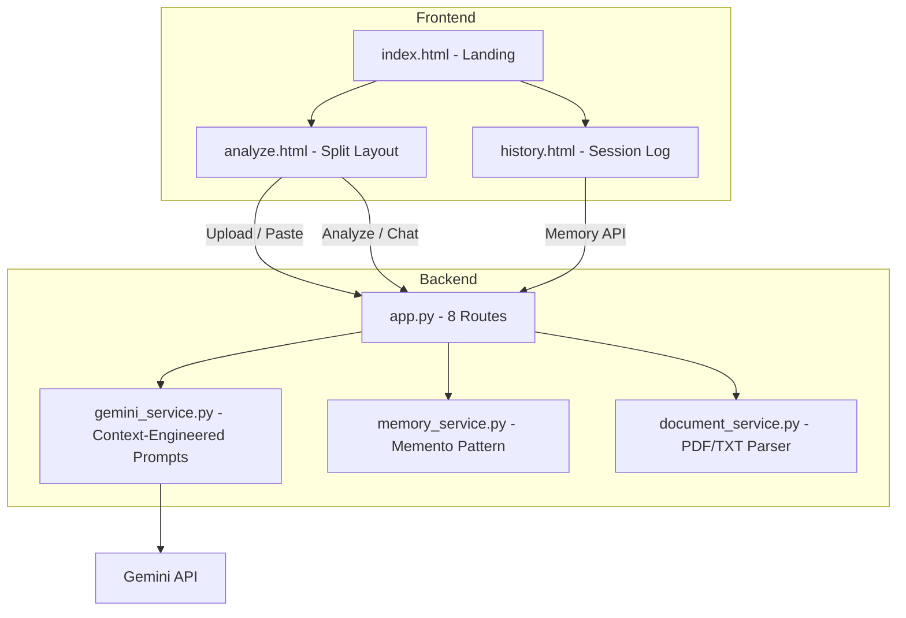

# ClauseClear AI

ClauseClear AI is a full-stack Generative AI web application designed for legal contract simplification. Powered by **Gemini 2.5 Flash Lite** with advanced context engineering best practices, it helps users analyze, summarize, and understand complex legal documents safely and effectively.

## Features

* **Advanced Context Engineering:** Implements system prompts, structured I/O (JSON), and progressive disclosure to ensure safety, boundaries, and reliability.
* **4 Core Analysis Modes:**
  1. Summarization
  2. Plain-English Translation
  3. Risk Highlighting
  4. Clause Tagging
* **Session Memory (Memento Pattern):** Chat with your contract! Remembers the last 10 turns of conversation for seamless follow-up questions.
* **RAG Context Integration:** Extracts PDF/TXT text and injects it as `GROUNDING CONTEXT` in every prompt.
* **Professional UI:** Dark-themed UI (navy/amber/gold) modeled after premium legal software, featuring split layouts, glassmorphism, and subtle animations.

## Tech Stack

* **Backend:** Flask (Python)
* **AI Provider:** Google GenAI API (`google-genai`), Gemini 2.5 Flash Lite
* **Frontend:** HTML5, CSS3 (Vanilla), Vanilla JavaScript
* **Utilities:** `PyPDF2` (Document Parsing), `python-dotenv` (Config Management)

## Getting Started

### Prerequisites

* Python 3.8+
* Google Gemini API Key

### Installation

1. **Clone the repository** (if applicable) or navigate to the project directory:
   ```bash
   cd GENAI-2
   ```

2. **Set up a virtual environment (Recommended)**
   ```bash
   python -m venv venv
   source venv/bin/activate  # On Windows: venv\Scripts\activate
   ```

3. **Install Dependencies**
   ```bash
   pip install -r requirements.txt
   ```

4. **Environment Variables**
   Create a `.env` file in the root directory and add your Google Gemini API key:
   ```env
   GEMINI_API_KEY=your_api_key_here
   ```

### Running the App

Start the Flask server:
```bash
python app.py
```

Then, open your browser and navigate to `http://127.0.0.1:5000/`.

## Architecture Overview



## Project Structure

```text
GENAI-2/
├── app.py                          # Flask app — 8 routes
├── config.py                       # Config + env loading
├── requirements.txt                # Dependencies
├── .env                            # Environment variables (not in version control)
├── services/
│   ├── gemini_service.py           # GenAI logic & context-engineered prompts
│   ├── memory_service.py           # Session history management
│   └── document_service.py         # PDF and text extraction
├── templates/
│   ├── base.html                   # Global layout
│   ├── index.html                  # Landing page
│   ├── analyze.html                # Main analysis workspace
│   └── history.html                # Session logs viewer
├── static/
│   ├── css/style.css               # Styling
│   └── js/app.js                   # Frontend interactivity & API calls
└── uploads/                        # Temporary file upload directory
```
