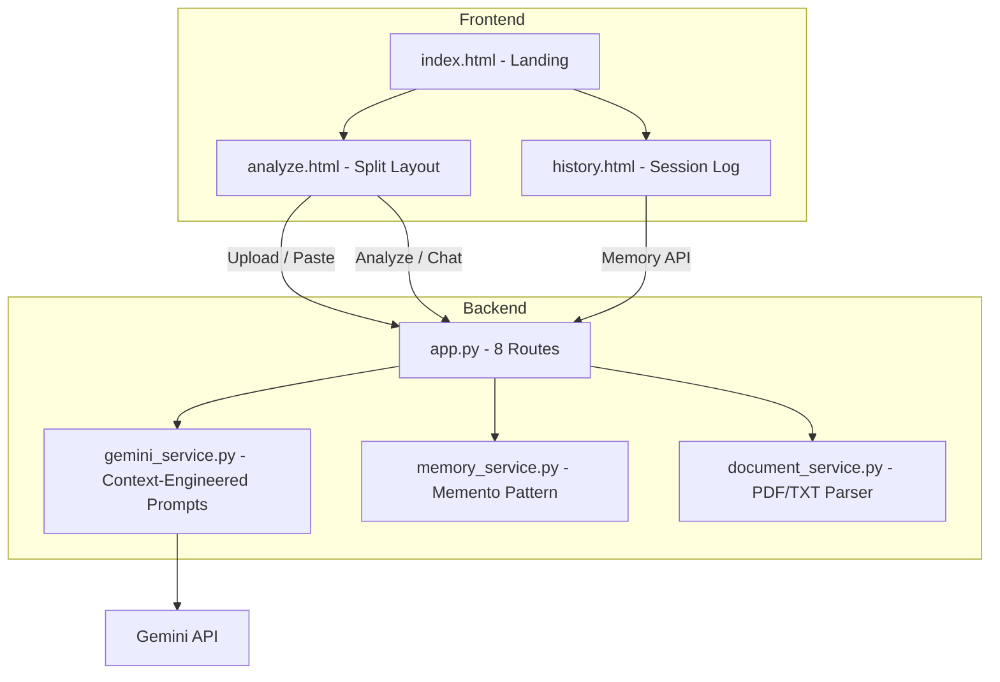

# ClauseClear AI — Build Walkthrough

## What Was Built

A full-stack Generative AI web application for legal contract simplification, powered by Gemini 2.5 Flash Lite with context engineering best practices.

## Architecture



## Project Structure

```
GENAI-2/
├── app.py                          # Flask app — 8 routes
├── config.py                       # Config + env loading
├── requirements.txt                # 4 dependencies
├── .env                            # Gemini API key
├── .gitignore
├── services/
│   ├── __init__.py
│   ├── gemini_service.py           # 4 feature prompts + chat (context-engineered)
│   ├── memory_service.py           # Memento pattern — last 10 turns
│   └── document_service.py         # PDF + TXT extraction
├── templates/
│   ├── base.html                   # Nav + footer + fonts
│   ├── index.html                  # Hero + feature cards + context engineering info
│   ├── analyze.html                # Split layout: input left, results right
│   └── history.html                # Session stats + timeline + turn log
├── static/
│   ├── css/style.css               # Dark navy + amber/gold + Playfair serif
│   └── js/app.js                   # Upload, 4 renderers, chat, memory
└── uploads/
```

## Context Engineering Implementation

Every Gemini API call follows these principles:

| Principle | Implementation |
|---|---|
| **System Prompt** | Role: "senior legal contract analyst". Behavioral guidelines + capability boundaries in every prompt |
| **Structured I/O** | Each feature has a strict JSON schema. Model instructed: "Return ONLY the JSON object. No markdown, no preamble." |
| **Session Memory** | Last 10 turns stored via Memento pattern, injected as `CONVERSATION MEMORY` block |
| **RAG Context** | Contract text injected as `GROUNDING CONTEXT` in every prompt |
| **Instruction Hierarchy** | Priority 1: Safety → Priority 2: User constraints → Priority 3: Output format → Priority 4: Enhancement |
| **Progressive Disclosure** | Every response: `quick_summary` → detailed analysis → `recommendations` |

## Routes

| Route | Method | Purpose |
|---|---|---|
| `/` | GET | Landing page |
| `/analyze` | GET | Analysis page (split layout) |
| `/history` | GET | Session history page |
| `/api/upload` | POST | Upload PDF/TXT, extract text |
| `/api/analyze` | POST | Run 1 of 4 analysis features |
| `/api/chat` | POST | Follow-up questions with memory |
| `/api/memory` | GET | Get session memory state |
| `/api/clear-memory` | POST | Clear all session memory |

## Design Theme

- **Background**: Deep navy (#060a14, #0a0f1e, #111b2e)
- **Accents**: Amber/gold (#d4a853, #f0c674, #b8923e)
- **Headings**: Playfair Display (serif) from Google Fonts
- **Body text**: Inter (sans-serif)
- **Cards**: Glassmorphism with backdrop blur
- **Animations**: Float orbs, fade-in, slide-up, spin loader

## Validation

- ✅ Flask server starts successfully on `http://127.0.0.1:5000`
- ✅ All 8 routes defined and functional
- ✅ Kluster code review executed
